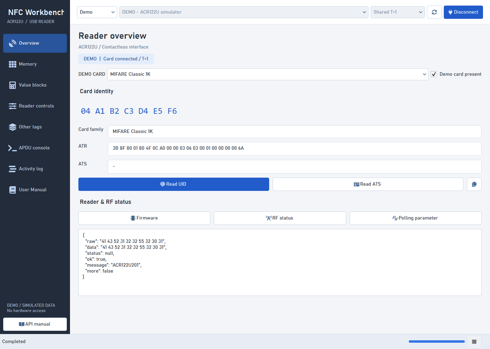
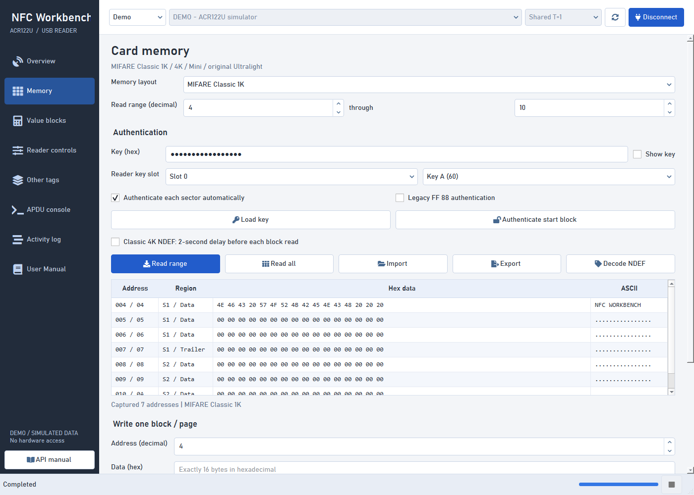
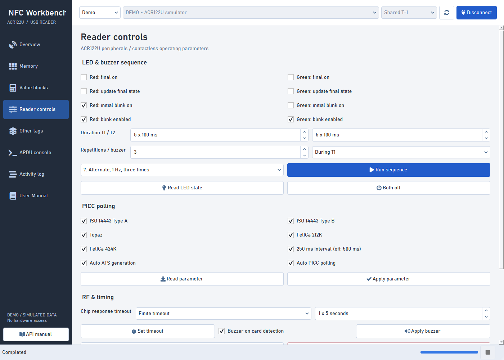
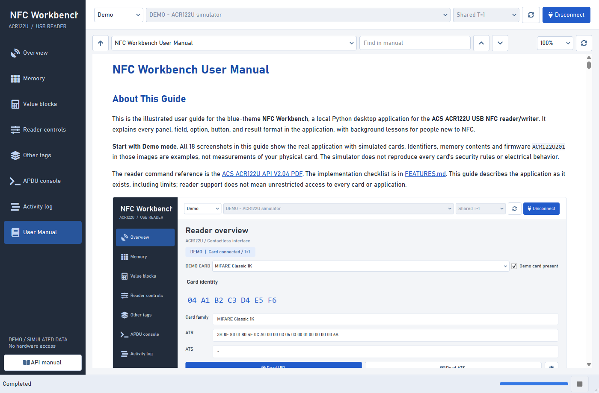

# NFC Workbench

[](https://github.com/sukantsondhi/NFC-Reader-UI/actions/workflows/windows.yml)
[](LICENSE)
[](https://github.com/sukantsondhi/NFC-Reader-UI/releases)

A local Python desktop application for the **ACS ACR122U USB NFC reader/writer**,
based on the supplied **API V2.04** manual. PySide6 provides the interface;
pyscard talks to the operating system's PC/SC service. No browser, cloud service,
account, or network connection is needed after installation.



*Actual application UI. All published screenshots use simulated cards, not private
hardware data. This is an independent project, not an ACS or NXP product.*

## Download and Run

**[Download the Windows x64 preview](https://github.com/sukantsondhi/NFC-Reader-UI/releases/tag/v0.1.0)**

1. Download `NFCWorkbench-v0.1.0-windows-x64.exe` from the release's **Assets**.
2. Double-click it. **Python is not required** for the standalone executable.
3. Choose **Demo** to explore without hardware, or connect your ACR122U, select
	**Shared T=1**, place one tag on the reader, and select **Connect > Read UID**.

The executable includes the blue UI, PC/SC bindings, Qt runtime, and the full
offline User Manual. The first startup extracts the bundled runtime into your
temporary directory and may take a little longer. Keep enough free disk space
for the download and extracted Qt runtime. No administrator rights are needed
for normal operation; driver installation/configuration is separate.

**Preview / unsigned:** Windows may show an unknown-publisher or SmartScreen
warning. Check the download source and SHA-256 hash against `SHA256SUMS.txt` on
the release, and follow your organization's policy. Do not disable antivirus.

```powershell
Get-FileHash .\NFCWorkbench-v0.1.0-windows-x64.exe -Algorithm SHA256
.\NFCWorkbench-v0.1.0-windows-x64.exe --demo
```

The release also supplies a third-party license archive and packaged-app smoke
report. Physical reader discovery and firmware were verified; physical card
writes and reader-setting changes still need acceptance testing with your tags.
Never use a production card to learn write commands.

## Screenshots

| Memory inspection | Reader peripherals |
| --- | --- |
|  |  |



## Illustrated User Manual

Read **[NFC Workbench User Manual](docs/USER_MANUAL.md)** for a complete guide to
every panel and option, with 18 blue-theme screenshots, safe demo walkthroughs,
beginner NFC explanations, a glossary, troubleshooting and further reading.
Open **User Manual** in the app sidebar to read the whole guide with local images,
section navigation, search, and zoom. It also works in VS Code's Markdown Preview.

## Run From Source

Double-click **[launch.cmd](launch.cmd)**. It uses the project-local `.venv`,
creates it if necessary, and installs missing dependencies on first launch.
Python 3.11+ (64-bit) and the Python launcher are required for first-time setup.

From PowerShell in this folder:

```powershell
.\launch.cmd
```

Try all panels without touching hardware:

```powershell
.\launch.cmd --demo
```

Manual setup, or to recreate an environment with a specific Python version:

```powershell
py -3.11 -m venv .venv
.\.venv\Scripts\python.exe -m pip install -r requirements.txt
.\.venv\Scripts\python.exe app.py
```

In VS Code select `.venv\Scripts\python.exe` as the Python interpreter if an
interpreter was previously selected. The workspace default does not override an
existing selection. Tests also run in that environment:

```powershell
.\.venv\Scripts\python.exe -m unittest discover -s tests -v
```

## First Card

1. Plug in the ACR122U. Windows normally supplies its CCID smart-card driver.
2. Select **Hardware**, your reader, and **Shared T=1**. Place one tag on it and
	 click **Connect**.
3. In **Overview**, read the UID. ATR identifies supported memory-card families;
	 ATS is optional and is not supported by every tag.
4. For Classic/Mini memory, enter your six-byte Key A or B in **Memory** and choose
	 slot 0 or 1. The displayed `FF FF FF FF FF FF` is a common factory key, not a
	 way to bypass authentication. Ultralight does not use Classic authentication.
5. Read a range or **Read all**. Select a row to load it into the write editor.
	 Export a backup before modifying a card. Imported dumps never write themselves.
6. Write a complete 16-byte Classic/Mini block or 4-byte original Ultralight page.
	 Each write requires confirmation and ordinary data writes are read-back checked.

Addresses in numeric controls are **decimal**; the memory table shows decimal and
hex together. Hex fields accept spaced bytes or compact even-length hexadecimal.
UID bytes are displayed in received order, without reversing or treating them as
an integer.

## Panels

| Panel | Operations |
| --- | --- |
| Overview | Reader/card status, ATR family, UID, ATS, firmware, PICC parameter, decoded RF status |
| Memory | Slots 0/1, Key A/B, modern/legacy authentication, single/range/full reads, protected-area guards, write verification, JSON import/export, NDEF inspection |
| Value blocks | Read, store, increment, decrement, same-sector restore/copy; uses Memory panel's layout/key settings |
| Reader controls | Red/green state and blink masks, timings, repetitions, buzzer links, all seven LED examples, all eight PICC bits, timeout, detection buzzer, antenna |
| Other tags | DESFire wrapped/native commands and Get Version chaining, initial auth challenge, FeliCa reads, Topaz/Jewel byte reads/writes and full read |
| APDU console | Arbitrary short APDUs, raw/native frames, escape commands, PN532 payload wrapping, selectable response decoder |
| Activity log | Timing, transmitted/received bytes, status, search, JSON/CSV export; last 2,000 exchanges |
| User Manual | Complete offline illustrated guide, section links, text search, image viewing and zoom |

The command-by-command implementation checklist and manual corrections are in
**[docs/FEATURES.md](docs/FEATURES.md)**.

## No-Card Reader Control

Choose **Direct / Escape** to query firmware or operate peripherals without a tag.
This uses `SCardControl(SCARD_CTL_CODE(3500))`, which is `0x003136B0` on Windows.
Shared connections transmit APDUs with T=1; the console can explicitly send escape
commands over a shared connection too.

Some drivers block vendor escape commands. Consult Appendix A of the supplied PDF
and the documentation for your installed driver. If required, an administrator
can enable the driver's `EscapeCommandEnable` DWORD for the **actual USB device
instance**, then unplug/replug the reader. Do not blindly copy historical registry
paths from the manual. This app never edits the registry or asks for elevation.
UID and normal memory commands through a shared card connection do not require
escape support.

## Safety And Limits

- Use cards you own or are authorized to manage. The app does not recover keys,
	clone protected UIDs, or bypass access permissions. A UID is not a secure proof
	of identity.
- Manufacturer blocks, sector trailers, and Ultralight lock/OTP pages are blocked
	by default. The explicit override and raw console can make irreversible changes.
	Protected Classic writes are acknowledged but not fully read-back verified,
	because keys/access changes can make the data unreadable. Keep recovery keys.
- Reader removal, card removal/change, or transport failure invalidates the
	connection. Reconnect explicitly. No write is automatically retried.
- A failed write transport or verification can have an **uncertain outcome**.
	Inspect the card before retrying, especially after increment/decrement.
- Cancellation is cooperative between commands. It cannot undo a transmitted write
	or interrupt a blocked driver call. `00`/`FF` device timeout modes may wait
	indefinitely. A long LED sequence may occupy the reader for its full duration.
- Keys are kept only in application memory; key-load command bytes are redacted
	from the activity log, including raw `FF 82` commands. Volatile reader key slots
	may persist until the reader is unplugged. Memory dumps, arbitrary APDUs and
	responses can still contain sensitive card data; protect exported files. Enable
	console command redaction for other key-bearing commands.
- Managed memory layouts cover Classic 1K, Classic 4K, Mini and the **original
	16-page Ultralight** described in this manual. NTAG and other Ultralight variants
	have different capacity/security layouts; additional areas require their own
	specification and the raw console. Unknown ATRs are not guessed for managed writes.
- NDEF inspection uses `ndeflib` and a bounded TLV parser. Read a continuous user
	range starting at address 4. Classic sector trailers are omitted from decoded
	content. Automatic MAD allocation, NDEF formatting and high-level NDEF writing
	are not implemented; arbitrary bytes can be written with the memory editor.
- DESFire **Auth challenge** implements the first command from section 7.2, not
	full mutual authentication or encrypted application/file management. Both
	command modes and additional frames are supported. Remove and re-present a card
	before changing native/wrapped mode; software disconnect alone may not reset it.
- FeliCa's documented read-without-encryption command uses a configurable service
	code and block. Service codes are entered as 16-bit hex numbers and encoded
	little-endian. Encrypted access and card-specific write commands require the
	card's specification and the raw console. Topaz helpers target the original
	memory map in the PDF, not every Type 1 variant.
- Demo mode is a deterministic, separate in-memory device, not a complete RF/card
	emulator. It covers these workflows but does not simulate every access-bit,
	timing, lock, encryption or electrical behavior. Unsupported demo commands fail
	rather than pretending to have succeeded. Switching demo profiles resets it.

## Troubleshooting

| Symptom | Check |
| --- | --- |
| No reader | USB connection, Device Manager's Smart card readers, Windows Smart Card service, then Refresh |
| Cannot connect shared | Put one compatible tag on the antenna; close other software holding an exclusive connection |
| `63 00` | Correct key/type/slot, authenticated sector, valid address, permissions, tag still present |
| `6A 81` on ATS | Normal for a tag that does not provide ATS |
| Escape command rejected | Driver support and optional administrator configuration above; reconnect after errors |
| Tags disappear after settings change | Re-enable RF and polling in Direct mode; unplug/replug to recover if necessary |
| Missing imports in VS Code | Select the project `.venv`; install requirements in that interpreter |

Linux/macOS use the same pyscard transport but were not hardware-tested here.
Linux requires the PC/SC daemon/CCID driver and may need PC/SC development packages
if pyscard has to compile. Windows is the primary tested platform.

## Build and Contribute

The Windows build runs tests, validates documentation and assets, collects
dependency licenses, creates a single `.exe`, and smoke-tests that executable
from a separate working directory in Demo mode.

```powershell
.\.venv\Scripts\python.exe -m pip install -r packaging/windows/requirements-build.txt -c packaging/windows/constraints.txt
.\.venv\Scripts\python.exe tools/build_windows.py
```

See [docs/RELEASING.md](docs/RELEASING.md) for the full build/release procedure,
[CONTRIBUTING.md](CONTRIBUTING.md) for development guidance,
[SECURITY.md](SECURITY.md) for responsible reporting, and
[CHANGELOG.md](CHANGELOG.md) for version history.

Original project code and documentation are [MIT licensed](LICENSE). Bundled
libraries retain their own licenses; see [docs/THIRD_PARTY_NOTICES.md](docs/THIRD_PARTY_NOTICES.md).
The ACS vendor PDF is deliberately not redistributed. **API manual** opens an
optional local copy, or ACS's official download.

## Verification

Protocol tests compare command bytes with the supplied PDF and cover special
responses, address boundaries and malformed data. Service tests use simulated
cards; Qt tests exercise window sizing and asynchronous UI workflows.

On the development machine the real reader **ACS ACR122 0** was detected and
returned **ACR122U216** from a direct escape firmware query. No tag was present.
Physical card reads/writes and peripheral changes therefore remain unverified;
no real card data or reader settings were modified during development.

## Repository Layout

```text
NFC-Reader-UI/
	nfc_workbench/        Application package: protocol, device, UI and demo
		assets/            Stylesheet, runtime icons and their attribution
		__main__.py        Application CLI and startup
	docs/                User manual, feature checklist and release/license guides
		images/            Screenshots and diagram referenced by the documentation
	packaging/windows/   PyInstaller specification, build dependencies and hooks
	tests/               Protocol, device, UI and repository regression checks
	tools/               Build, screenshot capture and publication-check commands
	.github/workflows/   Windows CI
	.vscode/             Shared interpreter and test-discovery settings
	app.py               Compatibility entry point for existing launch commands
	launch.cmd           Double-click Windows source launcher
	requirements.txt     Runtime dependencies
	pyproject.toml       Lint configuration
```

The root also keeps the standard README, license, changelog, contribution and
security files so GitHub and contributors can find them. Core modules live in
[nfc_workbench/acr122.py](nfc_workbench/acr122.py),
[nfc_workbench/device.py](nfc_workbench/device.py),
[nfc_workbench/ui.py](nfc_workbench/ui.py), and neighboring package files.

Both `python app.py` and `python -m nfc_workbench` launch the app from a checkout.
Windows packaging inputs are grouped in
[packaging/windows/NFCWorkbench.spec](packaging/windows/NFCWorkbench.spec).

Local `.venv`, caches, `build`, `dist`, `release`, and `artifacts` directories are
ignored and are not part of the published repository. The local ACS PDF and
private key/card-export patterns are ignored as well. Binaries belong in GitHub
Release assets, not Git history. The publication checker verifies local links,
referenced documentation/runtime images, and accidental generated/sensitive files:

```powershell
.\.venv\Scripts\python.exe tools/check_repository.py
```

Icons are provided by QtAwesome / Font Awesome Free. Attribution is in
[nfc_workbench/assets/README.md](nfc_workbench/assets/README.md).
