# NFC Workbench User Manual

## About This Guide

This is the illustrated user guide for the blue-theme **NFC Workbench**, a local
Python desktop application for the **ACS ACR122U USB NFC reader/writer**. It
explains every panel, field, option, button, and result format in the application,
with background lessons for people new to NFC.

**Start with Demo mode.** All 18 screenshots in this guide show the real
application with simulated cards. Identifiers, memory contents and firmware
`ACR122U201` in those images are examples, not measurements of your physical card.
The simulator does not reproduce every card's security rules or electrical behavior.

The reader command reference is the
[ACS ACR122U API V2.04 PDF](https://www.acs.com.hk/download-manual/419/API-ACR122U-2.04.pdf). The implementation checklist
is in [FEATURES.md](../FEATURES.md). This guide describes the application as it
exists, including limits; reader support does not mean unrestricted access to
every card or application.


*Figure 1. Overview after reading a demo UID and firmware. Click any screenshot
to inspect it at full resolution in your Markdown viewer.*

### Contents

- [Before You Begin](#before-you-begin)
- [Install and Open the App](#install-and-open-the-app)
- [NFC Fundamentals](#nfc-fundamentals)
- [Numbers and Hexadecimal](#numbers-and-hexadecimal)
- [Connection Bar and Navigation](#connection-bar-and-navigation)
- [Overview](#overview)
- [Memory](#memory)
- [NDEF Inspection](#ndef-inspection)
- [Value Blocks](#value-blocks)
- [Reader Controls](#reader-controls)
- [DESFire](#desfire)
- [FeliCa](#felica)
- [Topaz and Jewel](#topaz-and-jewel)
- [APDU Console](#apdu-console)
- [Activity Log](#activity-log)
- [Understanding Responses](#understanding-responses)
- [Troubleshooting and Recovery](#troubleshooting-and-recovery)
- [Practice Lessons](#practice-lessons)
- [Glossary](#glossary)
- [Further Reading](#further-reading)
- [Coverage and Verification](#coverage-and-verification)

## Before You Begin

Use only cards you own or are authorized to inspect and modify. A reader cannot
make an encrypted or access-controlled application freely readable.

| Action | What can change? | Beginner recommendation |
| --- | --- | --- |
| Read UID, ATS, firmware, RF status, or memory | No intentional persistent card-data write | Start here. Authentication or protocol state can still change. |
| Load a key / authenticate | Reader's volatile key memory / current security session | Use a known key and the correct card family. |
| LED, buzzer, polling, timeout, RF commands | Reader behavior | Read existing settings where a getter exists before changing them. |
| Ordinary memory write | Persistent card bytes | Back up first; practice on Demo or a disposable test tag. |
| Store/increment/decrement/restore value | Persistent card value data | Do not use a production balance, ticket, or access card for experiments. |
| Protected-area write or custom raw command | Potentially keys, access rules, one-time locks, or other sensitive state | Leave protected overrides off; learn the exact card specification first. |

**A backup is not a guarantee of recovery.** Secret keys may not be readable,
lock/OTP bits can be irreversible, and damaged access conditions can prevent
writing a backup back to the card. No button provides a general-purpose undo.

The app does not recover unknown keys, clone protected UIDs, or bypass card
permissions. A UID alone is not secure proof of identity.

## Install and Open the App

### Requirements

- Windows x64 for the standalone executable. Python is **not** required for that download.
- For running from source instead, 64-bit Python 3.11 or newer; the Python launcher
  is needed for the source launcher's first-time environment setup.
- An ACR122U for hardware use. No reader is required for Demo mode.
- A compatible card, and its known access key if required, for card operations.
- Internet access for installing dependencies the first time. The app itself is
  local and does not need an account, cloud service, or browser server.

### Standalone Windows Download

Download `NFCWorkbench-v0.1.0-windows-x64.exe` from the
[GitHub release assets](https://github.com/sukantsondhi/NFC-Reader-UI/releases/tag/v0.1.0)
and double-click it. It bundles the required runtime, guide and images. The
one-file launcher extracts the runtime to a temporary folder at startup; allow
extra time on the first run. Normal use does not require administrator rights.

The preview executable is unsigned. Compare its SHA-256 with the release's
`SHA256SUMS.txt`, verify the source, and follow your organization's Windows
software policy. Do not disable antivirus to run it. The adjacent license archive
contains the bundled dependencies' notices. Hardware setup still requires a
working Windows smart-card driver; the executable does not install or modify it.

```powershell
.\NFCWorkbench-v0.1.0-windows-x64.exe --demo
Get-FileHash .\NFCWorkbench-v0.1.0-windows-x64.exe -Algorithm SHA256
```

### Launch From Source on Windows

Double-click [launch.cmd](../launch.cmd), or run this from the repository folder:

```powershell
.\launch.cmd
```

The launcher uses the project-local `.venv`. If necessary, it creates the
environment and installs the libraries listed in
[requirements.txt](../requirements.txt).

For a safe first session:

```powershell
.\launch.cmd --demo
```

Manual installation is also possible:

```powershell
py -3.11 -m venv .venv
.\.venv\Scripts\python.exe -m pip install -r requirements.txt
.\.venv\Scripts\python.exe app.py
```

Windows normally supplies a compatible CCID smart-card driver. If no reader
appears, check **Device Manager > Smart card readers** and the Windows **Smart
Card** service. Do not replace drivers merely to enable ordinary UID reads.

### Open This Manual With Images

In the application, select **User Manual** in the sidebar. The complete guide,
tables, screenshots, glossary and reading links are available there without a
card connection or internet access. It remains readable while a card command runs.

| Manual toolbar control | Purpose |
| --- | --- |
| Up-arrow **Top of manual** | Return to the title and contents near the beginning. |
| **Manual section** dropdown | Jump directly to any heading or subsection. The contents links in the document also work. |
| **Find in manual** | Search the entire guide as you type; matching text is highlighted. Clear the field to clear matches. |
| Up/down chevrons **Previous match / Next match** | Move between search results; Enter also finds the next match. The counter shows the active match and total matches. |
| **Manual zoom** | Select 75%, 90%, 100%, 110%, 125%, or 150%. Text, tables and images scale together. |
| Circular arrows **Reload manual from disk** | Reload the current Markdown and return to the top. In a source checkout this picks up edits; the standalone executable uses its extracted bundled copy. |

Screenshots fit the reading area; click a screenshot to open the full-size PNG
in your default image viewer. External HTTP/HTTPS reading links open in your
default web browser only when clicked. PDF and other documentation links open in
their normal desktop application; executable/source-file links are not launched.
The embedded viewer does not load remote scripts or images.

In VS Code, open this file and choose **Open Preview** or press `Ctrl+Shift+V`.
GitHub's Markdown viewer can also display it. Keep the `docs/images` directory
with the guide; its images are local files and require no image-hosting service.

The app's separate **API manual** button opens a user-supplied local ACS PDF, or
the official ACS download if no local copy exists. The vendor PDF is not bundled;
this illustrated user guide and all its screenshots are bundled and work offline.
The README links to this guide. If an app window was already open before a theme
update, wait for any command to finish, export anything needed, close it, and
reopen the launcher. The stylesheet is loaded at startup, not hot-reloaded.

## NFC Fundamentals

### What the Reader Actually Does

**NFC** means *Near Field Communication*. This reader communicates with compatible
contactless tags at **13.56 MHz**, normally a few centimeters away. Many tags are
passive: the reader's RF field supplies the energy needed for communication.

A tag may look like a plastic card, sticker, token, or key fob. Its shape does not
tell you its protocol, memory size, security model, or whether it is writable.
This is not a universal reader for 125 kHz access tokens or UHF inventory tags.

The chain is:

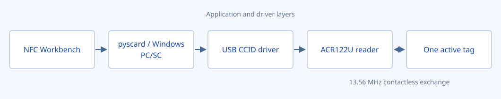

**PC/SC** is the operating-system interface used by smart-card applications.
**CCID** is the USB device/driver interface. You do not type low-level USB packets
into this application: the driver and pyscard handle that layer.

Place one tag on the reader. The ACR122U can resolve collisions during detection,
but this application accesses **one active tag at a time**. Do not stack cards
while learning; you may otherwise operate on a different tag than intended.

### Reader Commands Versus Card Commands

**Read UID** asks about the card. **Firmware** asks about the reader. **Write &
verify** changes card memory. **Apply buzzer** changes the reader's behavior.
This distinction determines whether you need a tag and which connection mode to use.

An **APDU** is a command or response represented by bytes. For example:

```text
FF CA 00 00 00
```

This is the reader's Get UID command. The returned UID is usually followed by
status bytes. For ordinary commands, `90 00` means success. However, not all
responses follow that rule; firmware, LEDs, polling parameters, and DESFire use
different formats. The [response chapter](#understanding-responses) explains them.

### Card Families Are Not Interchangeable

| Family / term | Mental model | Appropriate part of this app |
| --- | --- | --- |
| MIFARE Classic / Mini | Fixed-size memory blocks grouped into authenticated sectors | Memory and Value blocks |
| Original MIFARE Ultralight | Small 4-byte pages, including special lock/OTP pages | Memory using the original Ultralight layout |
| MIFARE DESFire | Applications and files accessed through a command protocol | Other tags > DESFire; custom commands require its specification |
| FeliCa | Services and blocks, identified using an IDm | Other tags > FeliCa |
| Topaz / Jewel | Original Type 1 tag commands and byte-addressed memory | Other tags > Topaz / Jewel |
| ISO 14443 Type A / Type B | Contactless communication variants, not memory capacities | Reader polling settings and supported card protocols |
| ISO 7816 / T=1 | Host-side smart-card communication conventions used through PC/SC | Shared T=1 connection and APDU console |

**Type A/B polling**, **Key A/B authentication**, and **NFC Forum Type 1/2/3/4**
are different classifications. Similar-looking names do not mean the same thing.
Newer NFC products or standards do not automatically add capabilities to an older
ACR122U or to the managed layouts in this application.

## Numbers and Hexadecimal

One **byte** contains eight bits and holds a value from 0 to 255. Hexadecimal
(*hex*) writes a byte using two characters: `00` through `FF`. Letters `A` through
`F` represent decimal 10 through 15.

| Decimal | Hex | Example use |
| --- | --- | --- |
| 0 | `00` | First address, or a special parameter value |
| 4 | `04` | Common first user page / example data block |
| 10 | `0A` | A decimal address of 10 is sent as hex `0A` |
| 16 | `10` | Classic block length in bytes |
| 32 | `20` | ASCII space byte |
| 103 | `67` | Last user byte in the original Topaz helper's default allowed range |
| 255 | `FF` | Maximum single-byte parameter |

**Numeric boxes with arrows use decimal.** Fields labeled **hex** use hexadecimal.
The memory table displays both, for example `010 / 0A`.

Accepted byte-field examples:

```text
FF CA 00 00 00
FFCA000000
ff ca 00 00 00
```

Do not paste `0x`, commas, colons, braces, or the manual's trailing `h` notation.
Each byte needs two hex digits. Ordinary spaces, line breaks and tabs can separate
complete bytes. `F` is incomplete; `0F` is a byte.

**Byte order matters.** The UI preserves UID byte order as received. FeliCa service
codes are entered as conventional 16-bit hex numbers and encoded little-endian
by the helper. Value-operation APDUs encode signed values most-significant byte
first. Do not manually reverse input unless the relevant control explicitly asks.

## Connection Bar and Navigation


*Figure 2. The connection bar remains visible while changing panels.*

### Connection Controls

| Visible control | Meaning and use |
| --- | --- |
| **Hardware / Demo** | Hardware uses the operating system's real readers. Demo uses an isolated in-memory simulator. Switching source replaces the session; it is not a preview overlay on hardware. |
| **Reader dropdown** | Select the PC/SC reader to use. Names are supplied by the driver, such as `ACS ACR122 0`. An empty list means no reader is currently available. |
| **Shared T=1** | Normal card connection. Place a tag on the reader before Connect. Use for UID, memory, values and tag-specific lessons. Other apps may share the reader unless they hold it exclusively. |
| **Direct / Escape** | Reader-level connection that does not require a card. Use for firmware or peripherals. Card APDUs are not normal card transactions in this mode. On Windows this mode can reserve the reader for private use. |
| **Refresh**, circular arrows | Rescan readers and card presence. The worker also checks approximately once per second while idle. Refresh does not automatically connect or read a UID. |
| **Connect** | Establish the selected session. Once connected, the button becomes Disconnect. |
| **Disconnect** | Release the session. It does not erase card data or guarantee a physical RF reset. Reader key slots can remain loaded until unplugged. |

Reader and connection-mode selectors are disabled while connected. Disconnect
before changing them. Controls are also disabled while an operation runs so
commands cannot accidentally overlap.

### A First Hardware Read

1. Select **Hardware** and your ACR122U.
2. Select **Shared T=1**.
3. Place one compatible tag on the antenna and leave it still.
4. Click **Connect**. A successful card connection displays an ATR and family.
5. Open **Overview** and click **Read UID**.
6. Record the UID if useful, then **Disconnect** when finished.

Card presence alone is not an active connection. After removal, replacement, or
a transport error, reconnect explicitly and inspect the new card. The app does
not automatically replay a write on a newly connected tag.

### Demo Controls

The Overview panel shows two additional controls in Demo mode:

| Control | Meaning |
| --- | --- |
| **DEMO CARD** dropdown | Choose Classic 1K, Classic 4K, Mini, original Ultralight, DESFire, FeliCa 212K, FeliCa 424K, or Topaz/Jewel. Changing it creates a fresh simulator and disconnects the old session. |
| **Demo card present** | Checked means a simulated card is present. Unchecking simulates removal and invalidates a shared connection. Check it and Connect again to simulate insertion. |

The sidebar says **DEMO / SIMULATED DATA / No hardware access** when the demo
state has loaded. No amount of demo writing changes a physical card. Demo memory
is not retained after resetting the profile or exiting.

### Sidebar, Status Bar, and Common Interactions

The sidebar opens **Overview**, **Memory**, **Value blocks**, **Reader controls**,
**Other tags**, **APDU console**, **Activity log**, and **User Manual**. The highlighted blue item
is the current panel. **API manual** opens the supplied vendor PDF.

Scroll inside a panel to reach its lower controls. Some tables and result boxes
also have their own scrollbars. Hover icons and table cells for tooltips, and use
the dropdown arrows to inspect choices. Selectable results can be copied as text.
The memory table itself is read-only; selecting a row loads the separate write editor.

| Status / control | Meaning |
| --- | --- |
| **Ready** | The UI is available; not a guarantee that hardware or a card is connected. |
| **Working...** | A command or operation is running. |
| Moving progress indicator | Duration is not yet known, often a single device command. |
| Advancing progress indicator | A memory range is being read one address at a time. |
| **Completed** | The requested software operation finished; inspect its result and any error banner. |
| Red message banner / **Operation failed** | Validation, transport, authentication or response decoding reported a problem. |
| Square **Stop** icon | Requests cancellation between commands. It cannot undo a transmitted write or interrupt every blocked driver call. |

Closing the window during an operation is refused until the operation finishes.
Cancel first if appropriate, then wait. If a driver is blocked indefinitely,
unplugging the reader may be necessary; a write in progress then has an uncertain
outcome. Export important captures before closing because logs are session-only.

## Overview

The Overview panel is for identifying the session and checking reader health.
Figure 1 shows the complete panel after a successful demo connection.

### Identity Fields and Buttons

| Field / button | What it means |
| --- | --- |
| Connection badge | Distinguishes LIVE or DEMO and card T=1 versus reader-direct connection. Disconnected states report a detected card, an empty reader, or no reader. |
| Large blue UID | The identifier last returned by **Read UID** for this session, displayed as hex bytes. `No UID read` means it has not been queried for the current connection. |
| **Read UID** | Sends `FF CA 00 00 00`. UID length depends on the tag; do not assume every card returns four bytes. |
| Copy icon beside UID | Copies the displayed UID text. Read the UID first so you do not copy a placeholder. |
| **Card family** | Best-effort identification from the ATR for known PC/SC memory-card codes. Unknown/ISO 14443-4 text is not a definitive product identification. |
| **ATR** | Answer To Reset reported through PC/SC at connection. It describes the communication/card type; it is not the UID or an application data dump. For contactless cards the reader constructs this PC/SC representation. |
| **ATS** | Answer To Select information returned by the reader when supported for the tag. It describes contactless protocol capabilities, not user memory. |
| **Read ATS** | Sends `FF CA 01 00 00`. An unsupported-function response on a Classic/Ultralight or another tag may be normal. |

An empty ATR and **No active card** in Direct mode are expected: you connected to
the reader, not necessarily to a tag. A UID should not be used alone as a login
credential, payment authorization, or proof that two captures came from the same
secure physical object.

### Firmware, Polling Parameter, and RF Status

| Button | Result and purpose |
| --- | --- |
| **Firmware** | Reads the reader's firmware string. This is a query, not a firmware update. The response is ten ASCII bytes, such as demo `ACR122U201`, with no ISO status pair. |
| **Polling parameter** | Reads the eight-bit PICC parameter and displays it. To load it into editable checkboxes, use **Reader controls > Read parameter**. |
| **RF status** | Queries the contactless controller's last error, external-field detection and target list. Useful when detection or communication behaves unexpectedly. |

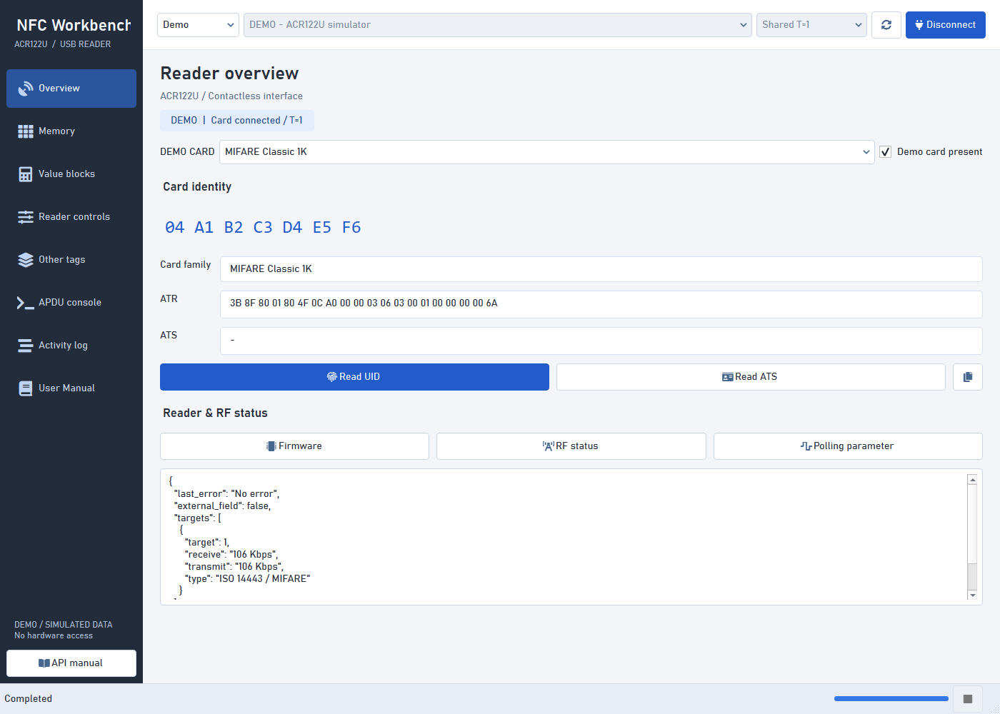

*Figure 3. RF status is decoded into named fields instead of showing only raw bytes.*

| RF result field | Interpretation |
| --- | --- |
| `last_error` | The controller's latest recorded error. It can describe an earlier event even though the status query itself succeeded. |
| `external_field` | Whether an **external** RF field is detected. `false` does not mean this reader's antenna is off. |
| `targets` | Detected/active targets reported by the controller. An empty list means this response contains no target entries. |
| `target` | Controller's logical target number, not the UID. |
| `receive` / `transmit` | Reported RF bit rates, such as 106, 212 or 424 Kbps. These are not USB speed settings. |
| `type` | Modulation/category such as ISO 14443/MIFARE or FeliCa; not a complete card model identification. |

### Working Without a Card

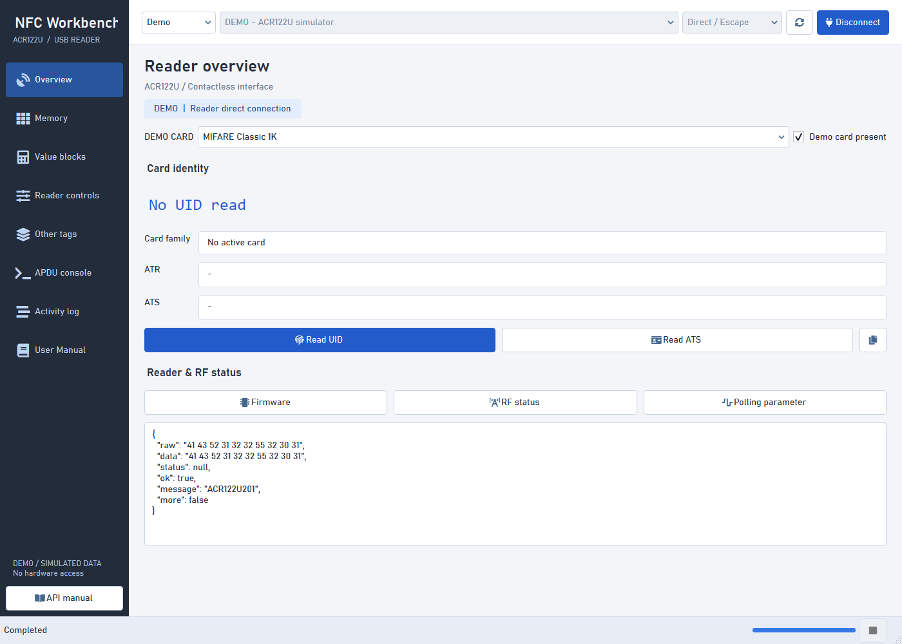

*Figure 4. A Direct connection can query the reader even though no card session is active.*

1. Disconnect any shared card session.
2. Select **Direct / Escape**, then **Connect**.
3. Click **Firmware** as a read-only escape-support check.
4. Use reader controls as needed, then disconnect.
5. Return to **Shared T=1** and place a card before attempting card operations.

Escape access uses `SCardControl` with `SCARD_CTL_CODE(3500)`. `3500` is the
function identifier; on Windows the resulting control code is `0x003136B0`.
Some drivers require optional administrator configuration. See
[Escape Errors](#escape-errors); the app never modifies the registry automatically.

## Memory

### Understand the Layout Before Writing

A **block** or **page** is the smallest managed write unit for the selected family.
A **sector** groups Classic/Mini blocks under access keys and permissions.

| Layout option | Total memory represented | Valid decimal addresses | Write unit | Organization |
| --- | --- | --- | --- | --- |
| **MIFARE Classic 1K** | 1,024 bytes | 0..63 | 16 bytes | 16 sectors, four blocks each |
| **MIFARE Classic 4K** | 4,096 bytes | 0..255 | 16 bytes | Sectors 0..31 have four blocks; sectors 32..39 have sixteen |
| **MIFARE Mini** | 320 bytes | 0..19 | 16 bytes | Five sectors, four blocks each |
| **MIFARE Ultralight** | 64 bytes | 0..15 | 4 bytes | Original 16-page layout; pages 4..15 are user data |

These capacities include special bytes and are not all freely writable user
storage. The Ultralight option is **not** a generic capacity selector for NTAG,
Ultralight C, EV1, or every product that reports a similar ATR.

In Classic/Mini, the last block of a sector is the **sector trailer**, containing
keys and access-condition information. Block 0 is manufacturer data. For example:

| Decimal addresses | Sector / role |
| --- | --- |
| 0, 1, 2, 3 | Sector 0; block 0 manufacturer, block 3 trailer |
| 4, 5, 6, 7 | Sector 1; data at 4..6, trailer at 7 |
| 124..127 on Classic 4K | Sector 31; trailer at 127 |
| 128..143 on Classic 4K | Sector 32; trailer at 143, not 131 |
| 240..255 on Classic 4K | Sector 39; trailer at 255 |

For the original Ultralight, pages 0..1 contain identifier-related bytes, page 2
contains internal/lock information, and page 3 contains one-time-programmable
data. Treat pages 0..3 as protected. One-time locks are not ordinary editable flags.

### Read and Authentication Controls


*Figure 5. A Classic demo capture. The table is a snapshot, not a live memory monitor.*

| Control | Default / allowed input | Purpose and behavior |
| --- | --- | --- |
| **Memory layout** | Classic 1K initially; may update when a known ATR connects | Selects addressing limits and block/page size. It does not format or convert the card. Managed reads/writes check this against the detected family. |
| **Read range (decimal)**, first box | 4 initially | First address, inclusive. |
| **through**, second box | 6 initially | Last address, inclusive. Set both boxes equal for a single address. The first must not exceed the last. |
| **Key (hex)** | Six bytes; factory example `FF FF FF FF FF FF` | A known Classic/Mini authentication key, not a password guessed by the app. Six bytes equal 12 hex digits. |
| **Show key** | Off | Reveals the entered key on-screen; use carefully when screen sharing. It does not change logging or card permissions. |
| **Slot 0 / Slot 1** | Slot 0 | Which of the reader's two volatile key locations to use. A reader slot number is not a card block or sector number. |
| **Key A (60) / Key B (61)** | Key A | Which key role the card should use for authentication. These are hex protocol codes; do not confuse them with Type A/B polling. |
| **Authenticate each sector automatically** | On | Loads the supplied key and authenticates as a read crosses into each sector. Writes/value operations authenticate their sector using these options too. |
| **Legacy FF 88 authentication** | Off | Uses the obsolete PC/SC authentication command. Leave off to use modern `FF 86` unless you have a specific compatibility reason. |
| **Load key** | Action | Loads the entered six-byte key into the chosen reader slot. It does **not** change a card's Key A/Key B. |
| **Authenticate start block** | Action | Authenticates the sector containing the first read-range address, using an already loaded slot and selected key type. It does not authenticate every sector. |
| **Classic 4K NDEF: 2-second delay before each block read** | Off | Adds the manual's recommended delay before each block during a Classic 4K range read. It has no effect on other profiles or on writes. |

Classic access permissions can differ between blocks and between Key A and Key B.
A successful authentication does not grant every possible read or write. Reading
a sector trailer normally does not reveal every secret key, so a dump may contain
masked key bytes and is not a complete key backup.

The original Ultralight does not use Classic sector authentication. Its key-entry
controls are disabled and automatic authentication is skipped. The standalone
Load key/Authenticate buttons are not required for it; do not use those actions as
a substitute for the security procedure of a different Ultralight/NTAG variant.

With automatic authentication **off**, the app does not load or authenticate for
you. A manual sequence is: enter key, choose slot/type, **Load key**,
**Authenticate start block**, then read within that sector. For a different sector,
authenticate again. The form holds one working key, not a per-sector key database;
read differently keyed sectors in separate operations.

### Read Buttons and Table

| Visible item | Behavior |
| --- | --- |
| **Read range** | Reads every address in the inclusive range. Reads use the selected layout's full unit: 16 bytes or 4 bytes. |
| **Read all** | Reads address 0 through the last address of the selected layout, including readable protected regions/trailers. It does not bypass permissions. |
| **Address** table column | Decimal and hex representation of the block/page address. |
| **Region** | Data/System; Classic/Mini rows also show `S<number>` and Trailer where applicable. |
| **Hex data** | Exact returned bytes for the row. |
| **ASCII** | Printable ASCII interpretation. A dot represents a non-printable byte; a dot does not necessarily mean an empty byte. |
| Capture label | Distinguishes complete, partial, imported/offline, and previous/not-live captures. |
| Row selection | Copies the selected address and bytes into the write editor below. It does not write anything. |

A new read clears the previous displayed capture. Export it first if needed.
Reading stops on an error or cancellation; successfully collected rows remain as
a **partial capture**. A read of all sectors can fail halfway if one key does not
work everywhere. Review the capture count before treating an export as a backup.

### Import and Export

**Export** opens a Save dialog for a JSON memory file. It exports the currently
captured rows, including a partial read if that is all you have. Give the file a
name that identifies the card, range, and date; the dump is not a complete audit record.

**Import** opens an Open dialog for an existing JSON export. The app validates
layout, addresses, unique rows, and byte lengths, and limits the file to 1 MiB.
It fills the table and selects the imported layout. **Import never restores or
writes a card automatically.** Select a row, verify the connected card and layout,
and explicitly use the write editor if you intend to write it.

An example single-block file:

```json
{
  "profile": "MIFARE Classic 1K",
  "rows": [
    {
      "address": 4,
      "data": "48 65 6C 6C 6F 20 4E 46 43 00 00 00 00 00 00 00"
    }
  ]
}
```

Live captures also include an ATR field. A saved ATR describes a capture; it is
not a secure identity check that makes later writes safe. Keep dumps private if
the data is sensitive. Cancelling an Open/Save dialog leaves the existing state alone.

### Write Editor and Confirmation

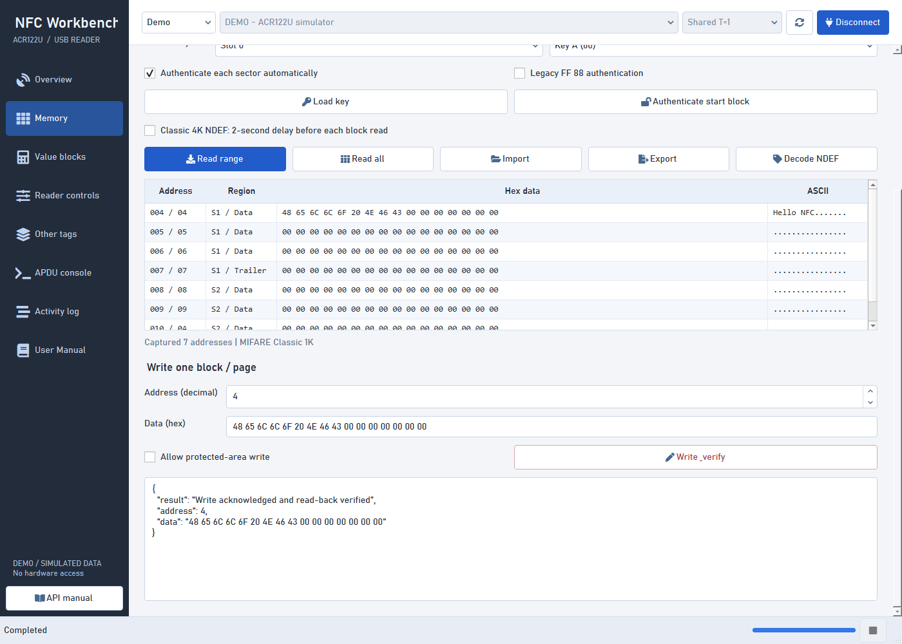

*Figure 6. The write editor is separate from the read-only table. Scroll down to reach it.*

| Control | Meaning |
| --- | --- |
| **Address (decimal)** | One block/page to overwrite. This is independent of the read-range boxes above. |
| **Data (hex)** | The complete replacement unit: exactly 16 bytes for Classic/Mini or 4 bytes for original Ultralight. The app does not pad short input or merge it with existing bytes. |
| **Allow protected-area write** | Off by default. Explicitly allows attempts on manufacturer/trailer/lock/OTP areas. Does not override hardware write protection or make irreversible writes recoverable. |
| **Write & verify** | Validates, asks for confirmation, writes one unit, then reads ordinary data back and compares it. It does not automatically write the entire table. |
| Result box | Reports acknowledgment/verification or the reason the operation failed. |

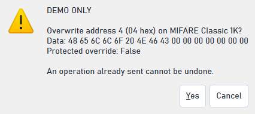

*Figure 7. Confirmation shows the destination and bytes. Cancel is the default answer.*

Before choosing **Yes**, check the reader/source, physical tag, address, data size
and replacement bytes. **Cancel** sends no write. If the connection changes during
confirmation, the app rejects the stale request. Protected overrides reset when
the connection/card changes.

For ordinary data, **acknowledged and read-back verified** means the immediate
read matched the bytes sent. It does not prove that the data is valid for a card's
higher-level application. Protected Classic writes cannot be fully verified this
way because key/access changes can affect readability; the result explicitly says
they were not read-back verified. Reconnect before using changed keys.

The table does not automatically become a new complete capture after a write.
Run **Read range** again to refresh it. If acknowledgment or verification is lost,
the write may already have happened. Follow [Uncertain Write Outcomes](#uncertain-write-outcomes),
not an automatic retry.

### Safe Demo Walkthrough: Write Plain Bytes

1. In Demo, choose **MIFARE Classic 1K** and Connect.
2. Read range **4 through 6**, using the factory demo key and automatic authentication.
3. Export the original capture.
4. In the write editor choose address **4** and enter:

   ```text
   48 65 6C 6C 6F 20 4E 46 43 00 00 00 00 00 00 00
   ```

5. Leave the protected override off, select **Write & verify**, check the dialog,
   and confirm only the demo operation.
6. Read range again. The ASCII column starts with `Hello NFC` and then dots.

This is raw ASCII followed by zero bytes. It is **not automatically an NDEF message**
that a phone will recognize. The next chapter explains the difference.

## NDEF Inspection

**NDEF**, NFC Data Exchange Format, is a common way to package meaningful records
such as text or a URI. A record has headers/type information plus a payload; a
plain string in arbitrary memory is not necessarily an NDEF record.

Some tag layouts store NDEF inside a **TLV** container: Type, Length, Value. The
type identifies what the following bytes represent, the length says how many
bytes follow, and the value contains those bytes. An NDEF TLV uses type `03`;
`FE` is a terminator and `00` can be padding/null TLV data.

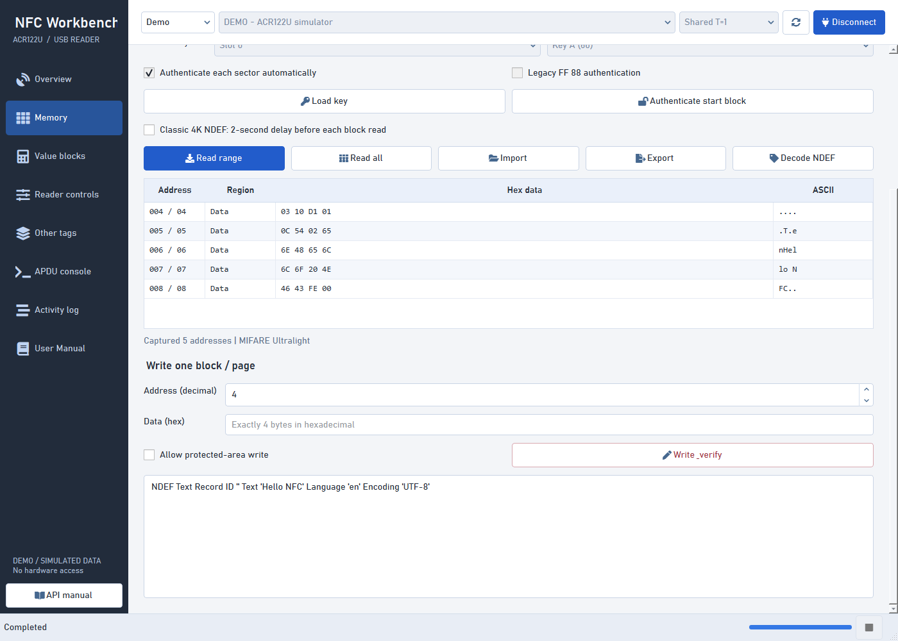

*Figure 8. The decoder recognizes a text record, language `en`, and UTF-8 encoding.*

**Decode NDEF** works on the displayed memory dump, not by sending a new card
read. Read a contiguous user-memory range starting at address **4** first. It
also works on an imported dump. For Classic, trailer rows are omitted when
assembling the candidate data stream.

This helper does not follow the Classic **MAD** directory, automatically choose
all NDEF sectors, format a card, set an Ultralight capability container, or write
high-level NDEF records. It is a bounded inspector for the supported contiguous
layout. If the record extends past the dump, read more memory; if it uses another
allocation scheme, obtain the relevant tag/mapping specification.

### Reproduce Figure 8 in Demo

Choose **Demo > MIFARE Ultralight**, Connect, and use the memory editor to write
the following five pages individually, with the protected override off:

| Page address, decimal | Four bytes, hex |
| --- | --- |
| 4 | `03 10 D1 01` |
| 5 | `0C 54 02 65` |
| 6 | `6E 48 65 6C` |
| 7 | `6C 6F 20 4E` |
| 8 | `46 43 FE 00` |

Then read **4 through 8** and click **Decode NDEF**. The `10` after `03` means
16 bytes in hex, not decimal 10. The record includes the text `Hello NFC` and
language `en`.

This is a **demo-only decoder lesson**, not a complete real-tag formatting recipe.
A phone-compatible tag also needs the correct capability/mapping data and access
conditions. Do not experiment with the real tag's OTP page to imitate a format.

## Value Blocks

A Classic/Mini **value block** is a specially formatted block representing one
signed integer with redundant data for consistency checking. It is not the same
as four ordinary bytes or an app's transaction database.

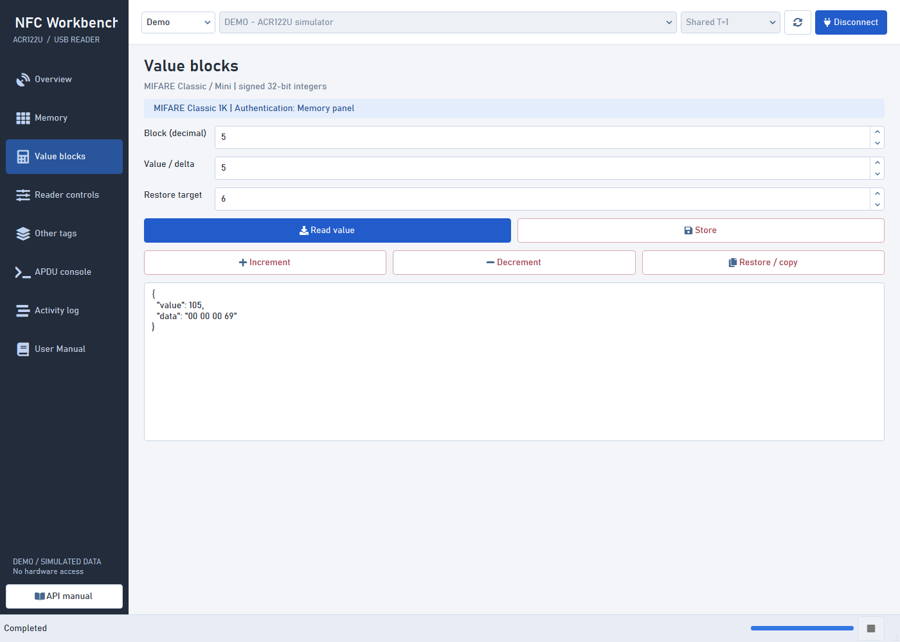

*Figure 9. A demo block was initialized to 100 and then incremented by 5.*

The badge shows the selected memory layout. **Authentication is shared with the
Memory panel**, including the key, slot, key type, automatic-authentication and
legacy options. Configure those there first.

| Control | Default / range | Purpose |
| --- | --- | --- |
| **Block (decimal)** | 5; numeric input permits 0..255 | Source/current value block. Actual card layout limits are enforced. Manufacturer block 0 and sector trailers are rejected. |
| **Value / delta** | 1; -2,147,483,648..2,147,483,647 | Replacement value for Store; amount used by Increment/Decrement. Use positive deltas while learning. |
| **Restore target** | 6; numeric input permits 0..255 | Destination for Restore/copy. Must be an allowed data block in the same sector as the source. Ignored by the other actions. |
| **Read value** | Read-only action | Reads an already formatted value block and displays its signed integer and returned bytes. |
| **Store** | Confirmation required | Overwrites the selected block and initializes/replaces its value-block contents. |
| **Increment** | Confirmation required | Adds the delta to an existing value block. It is not a safe retry operation if a previous result was lost. |
| **Decrement** | Confirmation required | Subtracts the delta from an existing value block. |
| **Restore / copy** | Confirmation required | Copies the source block's value to the target in the same sector; this does not load a backup file or undo an earlier change. |

All mutating actions ask for confirmation and then read the resulting value.
Ultralight and other tag families cannot use this panel's Classic value operations.
An ordinary/uninitialized block can reject **Read value**; use Store only when you
intend to replace its existing contents.

### Demo Sequence

1. Choose a fresh Classic 1K demo and Connect.
2. Select block **5**, value **100**, and **Store**. Confirm the demo change.
3. Set the delta to **5** and choose **Increment**. The result is **105**.
4. Set the delta to **2** and choose **Decrement**. The result is **103**.
5. With source **5** and target **6**, choose **Restore / copy**.
6. Change Block to **6**, then Read value. It should be **103**.

This exercises storage commands, not a secure payment protocol. Real balances
and ticket systems often have authentication, integrity checks and business rules
beyond this reader API. Physical value-block bytes and redundancy also need the
card's specification; the simulator is not a byte-accurate model of every format.

## Reader Controls

These controls affect the **reader**, not ordinary tag user memory. They can be
sent through a shared card session or, with driver support, a Direct/Escape session.

**Form defaults are not automatically measured hardware settings.** Changing a
checkbox/dropdown prepares a command; it does not send it until the corresponding
action button is pressed. For PICC settings, use Read parameter first. The UI has
no readback getter for the detection-buzzer setting or chip timeout in this API.

### LED and Buzzer Sequence


*Figure 10. The selected preset prepares alternating LEDs at one full cycle per second.*

The physical reader has red and green LED components. The UI's blue theme does
not change the colors the hardware can emit. **Masks** are permissions to update
particular LED properties: a requested final color without its update mask does
not apply that final-state change.

| Checkbox | P2 bit | What checked means |
| --- | --- | --- |
| **Red: final on** | 0 | Request red on after the sequence; needs Red: update final state. |
| **Green: final on** | 1 | Request green on after the sequence; needs Green: update final state. |
| **Red: update final state** | 2 | Apply the chosen red final state; unchecked leaves the final red state unchanged by this part of the command. |
| **Green: update final state** | 3 | Apply the chosen green final state. |
| **Red: initial blink on** | 4 | Red begins the blinking sequence on during T1, if red blinking is enabled. |
| **Green: initial blink on** | 5 | Green begins the blinking sequence on during T1, if green blinking is enabled. |
| **Red: blink enabled** | 6 | Allow red to blink; repetitions must be greater than zero. |
| **Green: blink enabled** | 7 | Allow green to blink; repetitions must be greater than zero. |

Unchecked final-on means an off request, but only when that color's update mask
is checked. Unchecked initial-blink-on means begin that enabled blink channel off.
Reader automatic behavior can also affect LEDs; the result is the reported final
state, not a live animation of the physical reader in the app.

| Timing / action control | Options and use |
| --- | --- |
| **Duration T1** | 0..255 units of 100 ms. Duration of the initial blink phase. Value 5 means 500 ms; 20 means 2 seconds. |
| **Duration T2** | 0..255 units of 100 ms. Duration of the toggled phase. |
| **Repetitions** | 0..255. Number of T1/T2 cycles. Zero disables blinking/buzzer activity, but a masked final-state update can still apply. |
| Buzzer **Off** | No sound linked to this sequence. |
| Buzzer **During T1** | Sound during the initial phase. |
| Buzzer **During T2** | Sound during the toggled phase. |
| Buzzer **During T1 + T2** | Sound during both phases. |
| Preset dropdown | Loads one of seven documented examples into the fields. Does not run it. You may edit the loaded fields; the preset label is not proof that its original values remain unchanged. |
| **Run sequence** | Sends the current fields. Sequences longer than 10 seconds ask for additional confirmation. |
| **Read LED state** | Queries the current state without asking to change either LED. |
| **Both off** | Immediately requests both final LED states off with no blink/buzzer sequence. |

Here **T1** is a duration phase, unrelated to the **T=1** PC/SC connection protocol.
The nominal sequence duration is `(T1 + T2) x repetitions x 100 ms`. With both
durations 5 and repetitions 3, the nominal total is 3 seconds. Long sequences can
occupy the reader; cancellation cannot necessarily interrupt one already sent.

For a buzzer-only sequence, clear all eight LED checkboxes, choose the buzzer
link and use a positive repetition count. For LEDs without sound, choose buzzer Off.

### Seven LED Presets

| Preset | P2 / T1 / T2 / repetitions / buzzer | Intended use |
| --- | --- | --- |
| **1. Read LED state** | `00 / 00 / 00 / 00 / 00` | Query only. |
| **2. Both LEDs on** | `0F / 00 / 00 / 00 / 00` | Set both final states on. |
| **3. Red off; green unchanged** | `04 / 00 / 00 / 00 / 00` | Apply only a red final-state change. |
| **4. Red pulse, 2 seconds** | `50 / 14 / 00 / 01 / 01` | Red initial-on blink pulse with T1 buzzer. `14` hex is decimal 20 duration units. |
| **5. Red blink, 1 Hz, three times** | `50 / 05 / 05 / 03 / 01` | Three red blink cycles, sound during T1. |
| **6. Both blink, 1 Hz, three times** | `F0 / 05 / 05 / 03 / 03` | Both blink channels start on; sound in both phases. |
| **7. Alternate, 1 Hz, three times** | `D0 / 05 / 05 / 03 / 01` | Red starts on and green off, then they alternate; sound during T1. |

Values in this table are **hexadecimal**. The numeric boxes display equivalent
decimal values. Presets 4..7 do not set final-state masks and are intended to
resume the existing final state after blinking. The PDF examples assume specified
initial states; your reader's returned final state may differ.

LED responses use `90` followed by a state byte: `00` both off, `01` red on,
`02` green on, `03` both on. `90 03` is successful LED control, not a generic ISO error.

### PICC Polling

**PICC** is the contactless card/tag. **Polling** is the reader repeatedly looking
for tags, not the app rereading all user memory.

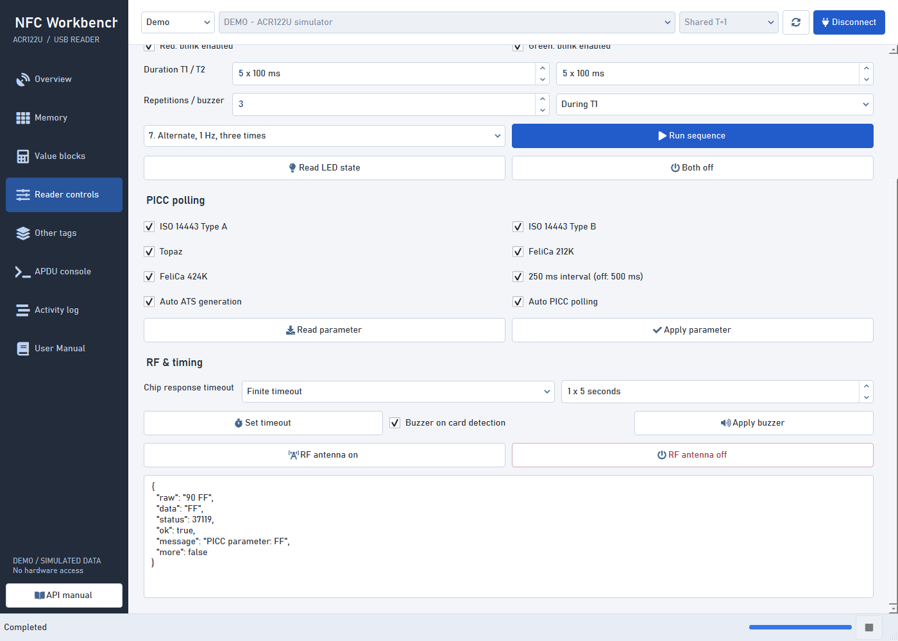

*Figure 11. Lower reader controls. Read the current parameter before editing its bits.*

| Checkbox | Bit | Checked / unchecked meaning |
| --- | --- | --- |
| **ISO 14443 Type A** | 0 | Detect / skip Type A tags, including relevant MIFARE families. |
| **ISO 14443 Type B** | 1 | Detect / skip Type B tags. |
| **Topaz** | 2 | Detect / skip Topaz tags. |
| **FeliCa 212K** | 3 | Detect / skip this FeliCa rate. |
| **FeliCa 424K** | 4 | Detect / skip this FeliCa rate. |
| **250 ms interval (off: 500 ms)** | 5 | Poll at 250 ms / 500 ms intervals. This is not the read-memory delay setting. |
| **Auto ATS generation** | 6 | Automatically request ATS when activating an applicable ISO 14443-4 Type A card / do not request it automatically. |
| **Auto PICC polling** | 7 | Enable / disable automatic tag polling. Turning it off can prevent normal card detection. |

**Read parameter** queries the reader and updates these checkboxes.
**Apply parameter** combines their bits into a byte, shows a confirmation, and
sends it. All boxes initially start checked (`FF`) as a UI default; that is not a
measurement until a read succeeds.

The ACS manual says to disable Auto ATS generation for MIFARE detection. Do not
change a working configuration without a reason. If following that guidance,
first read the current parameter and preserve unrelated bits. For example,
clearing only bit 6 from `FF` gives `BF`; it does not mean disabling Type A.
Keep a note of the original parameter so you can restore it.

The response is `90` followed by the reported parameter, not necessarily `90 00`.
Disabling polling or a tag type may invalidate the current card connection. A
Direct/Escape connection is useful for recovering the reader's detection settings.

### RF, Timeout, and Detection Buzzer

| Control | What it does / caution |
| --- | --- |
| **Finite timeout** | Use the adjacent numeric box, 1..254 units of five seconds. Initial form value 1 represents five seconds; it is not a hardware readback. |
| **00: No timeout check** | Sends special parameter `00`; the usual finite timeout check is disabled. Confirmation warns about a potentially blocked call. |
| **FF: Wait indefinitely** | Sends special parameter `FF`, waiting until the contactless chip responds. Avoid for routine beginner use. |
| **Set timeout** | Applies the selected chip-response timeout. It is not a UI timer, authentication timeout, or guarantee that Windows will abort every blocked operation. |
| **Buzzer on card detection** | Prepares the detection-beep preference. The form starts checked, consistent with the manual's default, but it is not queried from the reader. |
| **Apply buzzer** | Sends enabled (`FF`) or disabled (`00`) for the detection beep. Separate from the sound linked to an LED sequence. |
| **RF antenna on** | Requests antenna power on. |
| **RF antenna off** | Asks for confirmation, then requests antenna power off. The current tag may lose power/connection. |

To recover after RF off: disconnect the old card session, choose Direct/Escape,
Connect, then RF antenna on. If necessary also restore polling and applicable
tag-type bits. Disconnect, return to Shared T=1, and reconnect the card. If the
driver cannot send escape commands, unplug/replug may be needed.

There is no combined "restore every setting" button. Keep your original values;
do not assume all changes have identical persistence across drivers/firmware.

## DESFire

DESFire cards usually expose applications and files through commands, rather
than the Classic sector-memory abstraction. Knowing a Classic key does not
authenticate a DESFire application.

Use **Other tags > DESFire** with a Shared T=1 card connection. In Demo, choose
the DESFire profile on Overview and reconnect first.

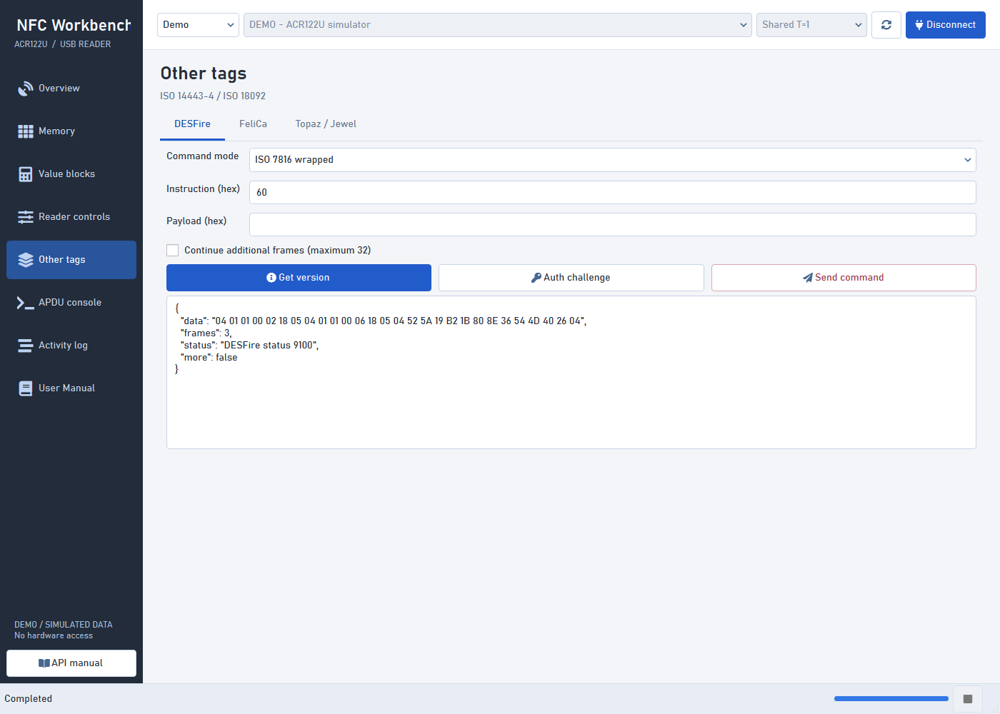

*Figure 12. Get Version automatically gathers the additional frames, up to a safety limit.*

| Control | Meaning |
| --- | --- |
| **Command mode: ISO 7816 wrapped** | Wraps the instruction in the DESFire `90 ...` APDU form; replies end in `91 xx`. |
| **Command mode: Native** | Sends the instruction/payload without ISO wrapping; the response starts with its status byte. |
| **Instruction (hex)** | Exactly one byte, initially `60`. Used by Send command. `60` is Get Version in the manual; `AF` requests an additional frame. |
| **Payload (hex)** | Optional data for Send command, up to 255 bytes. The correct payload depends on the instruction and card specification. |
| **Continue additional frames (maximum 32)** | Off initially. For a custom command, automatically sends additional-frame requests while the response indicates more data. Not appropriate for every multi-step protocol. |
| **Get version** | Uses instruction `60` and automatically follows additional frames regardless of the custom-command checkbox. Ignores the custom Instruction/Payload fields. |
| **Auth challenge** | Sends the manual's initial `0A` command for key number `00`, in the selected mode. Does not use the custom payload or a Classic key from Memory. |
| **Send command** | Builds a command from Instruction/Payload, confirms it, and sends it. Arbitrary instructions may change keys, data, or application state. |

**Choose one command mode per card activation.** The manual explains that the
first DESFire command selects the mode. The app guards mode changes within a
session, but software Disconnect is not guaranteed to reset the physical card.
Remove and re-present the card before changing mode, then reconnect. Raw console
commands can affect protocol state outside this panel's guard.

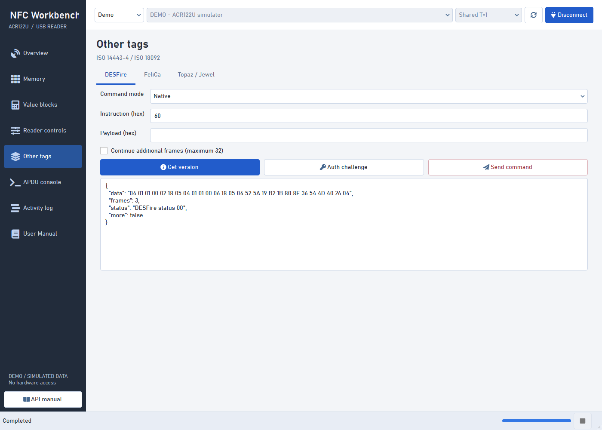

*Figure 13. Native mode preserves data that an ISO-style decoder could mistakenly strip.*

Results include `data`, `frames`, `status`, and `more`. In wrapped mode `91 AF`
means another frame; `91 00` means that command completed. In native mode the
equivalent status bytes are leading `AF` and `00`.

**Auth challenge is not completed authentication.** Its returned challenge is
only the first step of the card's cryptographic exchange. Do not treat it as
proof you can read protected files. Secure mutual authentication, encrypted
messaging, key diversification and application-specific management require the
card's documentation and an appropriate SDK. Blindly enabling additional-frame
chaining does not implement that protocol.

## FeliCa

A FeliCa card can contain multiple **services** with block-based data and access
rules. **IDm** is the eight-byte identifier used in the command frame. A service
code selects the relevant service, not a Windows service or reader index.

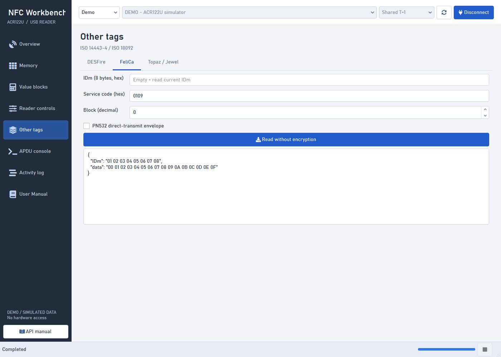

*Figure 14. Read Without Encryption for one simulated FeliCa block.*

| Control | Default / range | Purpose |
| --- | --- | --- |
| **IDm (8 bytes, hex)** | Empty initially | Empty reads the current IDm using Get UID. Otherwise supply exactly eight bytes; the helper checks the returned identifier. |
| **Service code (hex)** | `0109` initially | Exactly two bytes representing a 16-bit service code. Enter `0109` or `01 09`; the helper encodes it as `09 01` in the command. |
| **Block (decimal)** | 0; 0..65,535 | One service block to read. The card must actually provide it. |
| **PN532 direct-transmit envelope** | Off | Wraps the native FeliCa frame in a PN532 Data Exchange payload. Does not itself switch the top connection mode or remove card permission checks. |
| **Read without encryption** | Action | Requests one 16-byte block, validates the frame/identifier and FeliCa status flags, then displays data. |

The manual's `0109` is an example, not a universal readable service on every
FeliCa card. Obtain the correct service/block mapping from the card/application
documentation. Read Without Encryption is the command name, not permission to
read secret services. A nonzero FeliCa status flag can indicate an invalid or
inaccessible service/block even if the reader transport succeeded.

The 212K/424K profile names refer to RF rates, not memory sizes. The reader's
polling settings control which rates it detects. This panel has no encrypted
access or high-level write button; card-specific write commands require their
specification and the raw console. The ACR122U PDF only provides a concrete
read-without-encryption example here.

## Topaz and Jewel

The Topaz/Jewel helpers target the original NFC Forum Type 1 memory layout in
the supplied manual. They use byte addresses, unlike Classic's 16-byte blocks
or Ultralight's 4-byte pages.

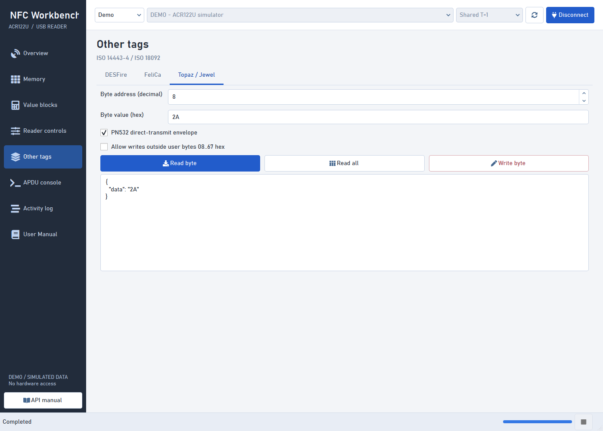

*Figure 15. A simulated byte write returned `2A`. Read byte separately to check it again.*

| Control | Meaning |
| --- | --- |
| **Byte address (decimal)** | 0..255, initially 8. The original helper's ordinary user range is decimal 8..103 (`08..67` hex); not every numeric address is valid on every card. |
| **Byte value (hex)** | Exactly one byte, initially `00`. Used by Write byte. Leave valid byte text in this field even when reading because the form validates it for all three actions. |
| **PN532 direct-transmit envelope** | Off initially. Wraps the native command using Data Exchange; same intent as the FeliCa envelope option. |
| **Allow writes outside user bytes 08..67 hex** | Off. Removes the app's ordinary-user-range guard, not the card's protection. Outside that range may be UID, reserved, lock or OTP storage. |
| **Read byte** | Reads the selected byte. Does not use the value as new data. |
| **Read all** | Sends the manual's read-all command. The response includes header information such as HR0/HR1; do not assume every returned byte is user memory starting at address 0. |
| **Write byte** | Confirms a single-byte replacement and checks the returned echo. It is not the independent read-back verification used by Memory. |

To reproduce Figure 15, use the Topaz/Jewel demo, Connect, set address **8** and
value **2A**, then Write byte. Next click Read byte and compare. Keep the protected
override off. `2A` is decimal 42; the address box uses decimal separately.

The original map groups bytes into 8-byte blocks. The relationship is
`byte address = block number x 8 + byte position`. The page does not expose a
separate block-number box. Larger Type 1 variants require their own specifications.

## APDU Console

The console is an advanced tool for explicit byte exchanges. It does not know
the meaning or safety of every custom instruction. **Raw commands bypass managed
memory-area guards**, so even a successful response may accompany an irreversible
change. Start with the read-only UID preset, not a command from an unknown source.

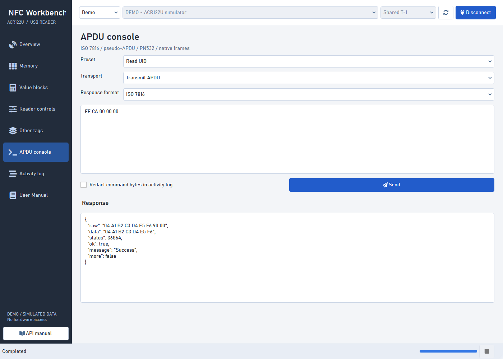

*Figure 16. The command field is what is sent; the response format determines how the answer is interpreted.*

### Presets and Input

| Preset | Bytes inserted | Decoder chosen |
| --- | --- | --- |
| **Read UID** | `FF CA 00 00 00` | ISO 7816 |
| **Read ATS** | `FF CA 01 00 00` | ISO 7816 |
| **Get Challenge** | `00 84 00 00 08` | ISO 7816 |
| **Firmware** | `FF 00 48 00 00` | Firmware ASCII |
| **RF status** | `FF 00 00 00 02 D4 04` | PN532 direct |
| **Custom** | Leaves existing fields unchanged | Leaves the current decoder unchanged |

Selecting a predefined preset also resets the transport choice to **Transmit
APDU**. Selecting it does not transmit. Editing the text after choosing a preset
means the preset name may no longer describe the bytes. Get Challenge works only
on cards/applications that implement that ISO command; it is not a universal
authentication procedure or the DESFire Auth challenge command.

The large editor accepts complete hex bytes, separated by whitespace if desired.
Console frames are limited to 1..261 bytes; PN532 payloads to 1..255 bytes. Extended
APDUs are not implemented. Correct byte syntax alone does not make the command
valid for the selected card.

### Transport Choices

| Choice | What to enter / what happens |
| --- | --- |
| **Transmit APDU** | Enter the complete APDU or native frame. On a shared connection it is sent with T=1 through `SCardTransmit`. |
| **CCID escape (3500)** | Enter the complete reader command. Uses `SCardControl`, including when the top connection is shared; requires driver escape support. |
| **Wrap PN532 payload** | Enter only the PN532 payload, for example `D4 04`. The app prepends `FF 00 00 00 <length>` and uses PN532 response decoding automatically. |

**A Direct/Escape connection forces the underlying exchange through escape**,
even if the console still says Transmit APDU. Check the Activity Log's actual
Route. For ordinary card APDUs, return to Shared T=1. PN532 wrapping and PC/SC
escape are different layers: wrapping changes bytes; escape changes the host
transport call.

Do not paste `FF 00 00 00 02 D4 04` into Wrap PN532 payload: that would wrap an
already wrapped command. Either use the RF status preset with Transmit APDU, or
use `D4 04` with Wrap PN532 payload. In the wrapping mode, the PN532 decoder takes
precedence over the visible response-format selection.

### Every Response Format

| Response format | When to use it | Success/interpretation |
| --- | --- | --- |
| **ISO 7816** | UID, ATS, memory, values, ordinary ISO commands | Treats the last two bytes as status; expects `90 00` for success. Does not automatically follow `61 xx` or retry `6C xx`. |
| **Firmware ASCII** | ACR122U firmware query | Expects the ten ASCII bytes, without stripping the final two characters as status. |
| **LED state** | LED/buzzer state-control command | `90` then a state byte; `90 01`, `90 02`, and `90 03` can all be success. |
| **PICC parameter** | Read/set PICC operating parameter | `90` then the returned parameter byte. |
| **PN532 direct** | PN532-wrapped responses | Checks outer status and the expected PN532 response envelope; Data Exchange error bytes are decoded too. Raw controller bytes remain visible. |
| **DESFire wrapped** | DESFire ISO-wrapped commands | `91 00` completes; `91 AF` means an additional frame. The raw console does not automatically chain. |
| **DESFire native** | Native DESFire command | Leading status byte; preserves trailing payload bytes that are not ISO status. Recognizes a padded status-only reply. |
| **Raw bytes** | A response not covered by these decoders | Does not interpret card status. `ok: true` here means a response was received without interpretation, not that the card operation succeeded. |

Picking a decoder does not change the card's command mode or repair a wrong
command. It only changes interpretation of the returned bytes, except for the
PN532 wrapping mode's automatic choice described above.

### Redaction and Send

**Redact command bytes in activity log** replaces the transmitted-byte field with
`[REDACTED]`. Use it for custom key-bearing commands. It does not redact the editor,
response data, screenshots, or memory dumps. Recognized direct `FF 82` key-load
commands are automatically redacted even if this checkbox is off; do not rely on
automatic recognition for every nested/proprietary key-bearing command.

**Send** validates byte syntax/length, asks for confirmation, and sends one frame.
Review the source, route and byte count. Cancel sends nothing. For a beginner test,
choose Read UID, connect Shared T=1, Send, and compare the data with Overview's UID.

## Activity Log

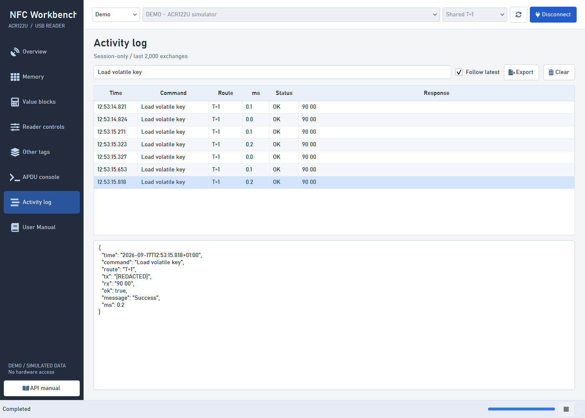

*Figure 17. Selecting a row shows its complete structured details; loaded keys are redacted.*

The log records the last **2,000 exchanges** in this window. Oldest entries are
dropped when the limit is reached. It is not automatically written to disk and
does not survive closing the app.

| Column / control | Meaning |
| --- | --- |
| **Time** | Local timestamp of the exchange. Export/detail data includes a fuller timestamp and offset. |
| **Command** | Operation name, for example Load volatile key or Read memory. |
| **Route** | Actual host transport: T=1 or Escape. A demo models the route label; it does not access hardware. |
| **ms** | Measured exchange time in milliseconds; not the RF bitrate or guaranteed end-to-end workflow duration. |
| **Status** | OK/ERROR from the selected response decoder or transport result. Raw bytes mode does not validate card-level success. |
| **Response** | Received bytes, or an error message if no reply was received. Hover/choose a row to inspect a long value. |
| Filter box | Case-insensitive matching across entry fields, including transmitted bytes and messages not shown as separate columns. |
| **Follow latest** | Automatically scrolls as exchanges arrive. Turning it off does not stop recording. |
| Row selection / lower detail box | Shows the full entry: `time`, `command`, `route`, `tx`, `rx`, `ok`, `message`, `ms`. |
| **Export** | Opens a Save dialog with JSON or CSV. Exports **all retained entries**, not only rows currently visible under the filter. |
| **Clear** | Deletes this window's retained log and detail view. Does not erase card memory, undo operations, or disconnect the reader. |

Memory authentication can generate several exchanges for one action: load key,
authenticate, read/write, then verification. The log lets you distinguish which
step failed. Not every UI validation error sends a frame or creates an exchange
entry; a syntactically invalid key can be rejected before contacting the reader.

Entries can span multiple connections or Demo/Hardware source switches. The
export does not contain complete reader/card provenance for each row. Keep notes
or separate exports when diagnosing different cards. Treat raw responses and
dumps as potentially sensitive even when the key-load command was redacted.

## Understanding Responses

Many result boxes display JSON-style fields. Quoted hex strings represent bytes;
unquoted numbers are decimal. `null` means there is no value for that field.

| Field | Meaning |
| --- | --- |
| `raw` | Complete bytes received, formatted in hex; preserve these when investigating an unfamiliar response. |
| `data` | Payload selected by the decoder. PN532 results can retain controller headers; reader state replies return their state byte. |
| `status` | Numeric status value when applicable; `null` for firmware/raw formats. It is displayed as a decimal integer, unlike `raw`. |
| `ok` | Success according to the selected decoder; apply the Raw bytes caveat above. |
| `message` | Human-readable interpretation, such as Success, firmware text, LED state or an error explanation. |
| `more` | Whether the decoder recognizes an additional DESFire frame. It does not imply every UI will automatically request it. |

For example, decimal status **36864** is hex `9000`; **36867** is `9003`;
**37119** is `90FF`. The latter two can be success for LED/PICC commands. A
firmware response with `status: null` is normal.

### Ordinary Card Status Codes

| Bytes | Interpretation / next step |
| --- | --- |
| `90 00` | Ordinary command success. Interpret the payload for that command. |
| `63 00` | Generic operation failure. Check card type, key, key role/slot, sector, address, permissions and presence. It does not prove that only the key was wrong. |
| `67 00` | Wrong command length. Check complete hex bytes and expected block/page size. |
| `69 82` | Security status not satisfied; required authentication/permissions are missing. |
| `69 85` | Conditions of use not satisfied; the card/application state may not permit the command. |
| `6A 81` | Function unsupported. Often expected for Read ATS on a tag without ATS support. |
| `6A 82` | File/application not found. Check the card application's specification. |
| `6A 86` | Incorrect P1/P2 parameters. |
| `6B 00` | Invalid/out-of-range address. |
| `6D 00` | Instruction not supported. |
| `6E 00` | Command class not supported. |
| `61 xx` / `6C xx` | Some ISO applications use these for more response data/correct length. The console does not automatically follow or retry them. |
| Other values | Retained and displayed numerically. Consult the specific card command reference rather than guessing. |

DESFire `91 AF`/`91 00` and the LED/PICC state replies use their dedicated formats.
Do not apply this ordinary-ISO table blindly to them.

### PN532 Contactless Errors

PN532 errors are controller-level bytes, not two-byte ISO status words. They can
appear inside a direct response or as RF status's last error. The app provides
names for the errors listed in the ACS PDF:

| Code(s), hex | Meaning | Useful first check |
| --- | --- | --- |
| `00` | No error | Continue interpreting the rest of the response. |
| `01` | Target did not answer in time | Keep the card still and check protocol compatibility. |
| `02`, `03` | CRC / parity error | Position, interference and contactless communication quality. |
| `04`, `05`, `06` | Bit count / framing / collision error | Use one tag, correct protocol and stable placement. |
| `07`, `08`, `0E` | Communication/RF/internal buffer problem | Check command/frame length and the applicable protocol. |
| `0A`, `0B` | External-field timing / RF protocol error | Peer/target state and the expected mode. |
| `0D` | Overheating; antenna drivers disabled | Stop operations and allow the hardware to cool; investigate recurrence. |
| `10` | Invalid parameter | Check command fields and ranges. |
| `12`, `13` | Unsupported DEP command / invalid frame format | Use the correct target protocol and frame structure. |
| `14` | MIFARE authentication failure | Known key, key type, sector and card family. |
| `23` | UID check-byte error | Re-present the tag and check communication quality. |
| `25`, `26`, `27` | Invalid state / disallowed configuration / wrong command context | Re-establish the intended connection and target state. |
| `29` | Target released | Reconnect appropriately. |
| `2A`, `2B` | Type B card exchanged / disappeared | Re-present the intended card and reconnect; do not replay writes. |
| `2C`, `2E` | NFCID3 mismatch / missing NAD | Inspect the DEP protocol frame and peer parameters. |
| `2D` | Over-current detected | Stop and investigate hardware/power; do not repeatedly retry. |

**PC/SC errors are another layer.** Messages such as no reader, no smart card,
sharing violation or service unavailable come from Windows/driver calls, often
with an eight-digit hexadecimal code. They are not card response bytes. Include
the full message when asking for support.

## Troubleshooting and Recovery

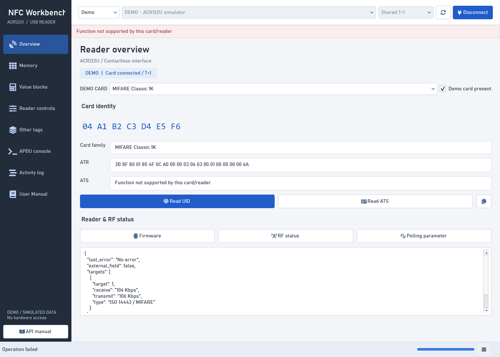

*Figure 18. This ATS error is expected for the demo Classic tag; it does not imply the reader is broken.*

| Symptom | What to do |
| --- | --- |
| Empty reader list | Check USB, Device Manager, Smart Card service and Refresh. Close software holding the reader exclusively. |
| Reader listed but Connect fails in Shared mode | Present one compatible tag. Move it nearer the antenna center. Ensure the connection mode is Shared T=1. |
| Firmware works but UID fails in Direct mode | Disconnect and reconnect Shared T=1 with a tag. Reader-level access is not a normal card session. |
| UID works but memory fails | A readable identifier does not mean readable user memory. Check detected family, known key, slot/type and access rights. |
| Read all stops partway | Review the partial capture and failed sector. Different sectors may require different keys; read known regions separately. |
| Selected layout rejected | Do not use the dropdown to override an unknown card's physical layout. Obtain the exact card data sheet; managed helpers intentionally reject a mismatch. |
| Write editor rejects length | Enter a full 16-byte block or 4-byte page as appropriate. Do not paste ASCII text into a hex byte field. |
| NDEF not found | Confirm the dump starts at user address 4 and actually contains a supported TLV layout; raw text or proprietary data is not NDEF. |
| NDEF extends beyond dump | Read more contiguous memory if the card layout permits it. |
| LED final state did not change | Check the matching update-final-state mask. For blinking, also check the blink mask and positive repetitions. |
| No sequence buzzer | Choose a non-Off link and positive repetitions. Detection beep uses a different setting. |
| Card disappeared after changing settings | Restore RF, polling and tag detection using Direct/Escape, then reconnect Shared. |
| DESFire mode rejected | Remove and re-present the card, reconnect, and use one mode consistently. |
| Value read fails on ordinary data | The block may not be a value block. Do not initialize it with Store unless replacement is intended. |
| Result box contains old data | It is the last operation's output, not a continuously refreshed monitor. Read again for the current session. The write editor can also retain typed text across card changes; check the new unit size. |
| App says it cannot close yet | Wait for the operation, or request Stop between commands. A blocked driver call may require unplugging the reader. |
| Images missing from this guide | Keep `docs/images` beside the Markdown file and use Markdown Preview, not plain-text view. |
| Old green theme remains in an open window | Close it after saving captures, then relaunch. Existing windows do not reload styles automatically. |

### Escape Errors

If Direct/Escape firmware queries fail, first confirm the installed driver's
vendor-escape support. The supplied PDF's Appendix A describes an optional
`EscapeCommandEnable` DWORD, but its registry examples target older Windows
versions and show more than one product identifier.

Do not copy a historical registry path blindly. If a change is needed, have an
administrator consult current driver guidance, identify the **actual device
instance**, back up the relevant settings, and unplug/replug after the change.
The application does not request elevation or alter these settings itself.
Normal shared UID/memory commands do not generally require escape support.

### Uncertain Write Outcomes

A write can reach the card even when its response does not reach the application.
A read-back check can also fail after a successful write, for example if the card
is moved away. Therefore an error is not proof that no data changed.

1. Stop sending mutating commands.
2. Record the message and export the relevant log before clearing it.
3. Re-present the intended card, reconnect and verify its identity/context.
4. Read the affected block/page/value without changing it, if still permitted.
5. Compare against the original backup and intended result.
6. Decide whether another write is needed only after establishing the current state.

Do not blindly repeat increments/decrements: a repeated successful command
changes the value twice. Protected-area changes may prevent recovery even with a
backup. Confirmation protects against accidental requests, not RF/power failure.

## Practice Lessons

These lessons are intended for **Demo**. They teach the interface without making
assumptions about a production card's layout or keys.

| Lesson | Steps | What to learn |
| --- | --- | --- |
| 1. Identification | Connect Classic demo, Read UID, copy it, then Read ATS | Identifier versus protocol capability; an unsupported ATS can be normal. |
| 2. Memory snapshot | Read 4..6, inspect hex/ASCII, Export, Import the same file | Read snapshots, decimal/hex addresses and offline dumps. |
| 3. Deliberate write | Follow the Hello NFC write walkthrough; first Cancel, then confirm a demo write | Confirmation is the boundary before mutation; verification is not application-level validity. |
| 4. Structured content | Use the five-page Ultralight NDEF lesson, read 4..8, Decode NDEF | Plain bytes versus TLV versus an NDEF record. |
| 5. Value semantics | Store 100 in block 5, increment by 5, decrement by 2, copy to block 6 | Special value-block operations and same-sector restriction. |
| 6. Reader configuration | Read parameter, note `FF`, inspect each bit without applying changes | Form controls versus queried hardware state; bit masks. |
| 7. Frame chaining | Choose DESFire, Get version; reset demo and compare Native mode | A logical result can span several command/response frames. |
| 8. Diagnostics | Filter Activity Log for Load volatile key and inspect the selected entry | Redaction, multiple exchanges per action, and log versus memory export. |

Next, try **read-only** firmware and UID queries on your physical reader. Only
move to writes after identifying the exact card and its security/memory model.
Demo success is not a hardware compatibility certificate.

## Glossary

| Term | Plain-language meaning |
| --- | --- |
| ACS / ACR122U | Reader manufacturer / the USB reader family this app targets. |
| NFC | Short-range contactless communication technology used by compatible tags and readers. |
| RF / antenna | Radio-frequency field / component that couples the reader to a nearby tag. |
| PICC | Proximity integrated-circuit card, the contactless card/tag in the manual. |
| PCD | Proximity coupling device, the reader side of the contactless exchange. |
| PC/SC | Standard host interface used by smart-card software to access readers and cards. |
| CCID | USB smart-card-reader interface handled by the device driver. |
| Firmware | Software running inside the reader; its version is not the desktop app's version. |
| ATR | PC/SC Answer To Reset information returned at connection, useful for card-family identification. |
| ATS | Answer To Select, describing applicable contactless protocol capabilities. |
| UID | Identifier returned for a tag; not automatically a trusted security credential. |
| IDm | FeliCa's eight-byte identifier used in its commands. |
| APDU | Application Protocol Data Unit, a command or response byte sequence. |
| Pseudo-APDU | Reader-specific command shaped like an APDU, for example LED control or direct transmit. |
| CLA / INS | APDU class / instruction byte. The meaning depends on the command protocol. |
| P1 / P2 | APDU parameter bytes; their meaning depends on the instruction. |
| Lc / Le | Command-data length / expected response length. A zero Le can have a protocol-defined maximum-length meaning. |
| SW1 / SW2 | Two response status bytes in an ISO-style format; not present in every response. |
| T=1 | PC/SC smart-card protocol used for this reader's shared connection; not the LED duration T1. |
| PN532 | Contactless controller whose command/response frames can be carried by direct transmit. |
| Escape / IOCTL | A driver control-command route rather than an ordinary card APDU exchange. |
| Native / wrapped | Original protocol bytes / those bytes carried inside another command structure. |
| Payload | The data portion carried by a command or response. |
| Frame / chaining | One protocol unit / collecting a multi-part exchange across additional frames. |
| Polling | Repeatedly looking for a tag; separate from reading all of its memory. |
| Bit / byte / hex | Binary on/off value / eight bits / base-16 notation for values. |
| Mask | Bits controlling which properties should be updated or activated. |
| Block / page | A memory addressing/write unit whose size depends on the card family. |
| Sector | Group of Classic/Mini blocks with common authentication/access information. |
| Sector trailer | Special Classic/Mini block containing keys and access conditions. |
| Authentication | A protocol that proves knowledge of a secret key or other credential. Not the same as reading a UID. |
| Authorization / access conditions | Rules determining which operations an authenticated role may perform. |
| Key A / Key B | Distinct Classic key roles, not polling protocols. |
| Key slot / volatile | Reader storage location for a key / storage that is not permanent across device power loss. |
| OTP / lock bits | One-time-programmable or locking information that can cause irreversible changes. |
| Value block | Special integer-storage format used by Classic/Mini value commands. |
| NDEF / record | Common NFC content format / one typed item inside an NDEF message. |
| TLV | Type-Length-Value container describing the type and size of following data. |
| MAD | MIFARE Application Directory, an allocation structure used by some Classic applications. |
| ASCII / UTF-8 | Text encodings. The table's ASCII preview is not a general-purpose UTF-8/NDEF decoder. |
| Endianness | The order in which the bytes of a multi-byte number are stored or transmitted. |
| CRC / parity | Checks used to detect communication corruption, not encryption or proof of identity. |
| DEP / NAD / NFCID3 | Advanced NFC data-exchange protocol / node address / peer identifier terms that may appear in controller errors. |
| Dump / snapshot | A saved or displayed copy of bytes read at a point in time; it may be partial or stale. |
| Read-back verification | Reading after a write and comparing the observed bytes with the requested bytes. |

## Further Reading

Read in the order below. The first three resources build the conceptual
foundation; the later ones are useful when working with raw commands or code.
Online resources can describe newer hardware than this app supports, and some
formal standards/card documents require membership or an account.

| Resource | Level | What to focus on |
| --- | --- | --- |
| [NFC Forum introduction](https://nfc-forum.org/learn/what-is-nfc/) | Beginner | What NFC is, near-field communication, and common applications. Do not treat short range alone as a security guarantee. |
| [Sony: Overview of FeliCa](https://www.sony.co.jp/en/Products/felica/about/index.html) | Beginner | How contactless cards can provide multiple services; why application permissions matter. |
| [ACS API V2.04](https://www.acs.com.hk/download-manual/419/API-ACR122U-2.04.pdf) | Beginner to advanced | Sections 3..4 for ATR/UID; section 5 for Classic memory; section 6 for reader settings; section 7 for other tags; appendices for escape/errors/LED examples. |
| [NDEF record types](https://ndeflib.readthedocs.io/en/latest/records.html) | Intermediate | Difference between Text, URI and other records; use the Text and URI subsections first. |
| [ndeflib decoder/encoder guide](https://ndeflib.readthedocs.io/en/latest/) | Intermediate / Python | How bytes become typed records and how records can be encoded. A library's encoding API does not mean this UI includes an NDEF writer. |
| [pyscard user guide](https://pyscard.sourceforge.io/user-guide.html) | Intermediate / Python | Reader-centric connections, ATRs, APDUs, status checking and monitoring. |
| [Microsoft: SCardConnect](https://learn.microsoft.com/en-us/windows/win32/api/winscard/nf-winscard-scardconnectw) | Advanced / Windows | Shared versus Direct access and protocol negotiation; useful when diagnosing driver/connection errors. |
| [Sony FeliCa technical information](https://www.sony.co.jp/en/Products/felica/business/tech-support/index.html) | Advanced | The exact command set and access model of the relevant FeliCa product. |
| [NXP documentation portal](https://www.nxp.com/documentation) | Intermediate to advanced | Find the data sheet for the exact Classic, Ultralight/NTAG, or DESFire part. Study memory maps, access conditions, lock bits and supported security commands before writing. |
| [NFC Forum specifications](https://nfc-forum.org/build/specifications) | Advanced | NDEF and tag mappings when implementing interoperability; availability/licensing varies. |

The vendor PDF contains a few inconsistent examples. This app follows
**`FF CA 01 00 00` for ATS**, **Le=`04` for Read Value**, and Classic sector 14's
data range **`38..3A` hex**. See [FEATURES.md](../FEATURES.md) for the corrections
and reasons. These small distinctions matter when comparing raw command bytes.

## Coverage and Verification

This guide covers every current panel and option. It does **not** claim the app
implements every feature of every tag technology. Current boundaries include:

- Managed layouts are Classic 1K/4K, Mini and original 16-page Ultralight.
- NDEF is inspection of a supported dump layout, not automatic formatting,
  MAD allocation or high-level NDEF writing.
- DESFire supports the manual's commands, framing and initial challenge, not a
  complete authenticated/encrypted application manager.
- FeliCa provides the documented read helper; encrypted access and card-specific
  writes require additional specifications and explicit raw commands.
- Topaz helpers use the original layout, and their write check is an echo check.
- Demo is an isolated workflow simulator, not a complete RF, timing, access-bit,
  encryption or value-block-storage emulator.

The app's automated tests exercise protocol examples, guards, simulated workflows,
window sizing and asynchronous UI actions. Earlier physical verification on the
development machine detected **ACS ACR122 0** and read firmware **ACR122U216** via
Direct/Escape. No card was present then, so physical card reads/writes and reader
setting changes were not validated. The illustrations are deliberately Demo-only.

### Maintain the Illustrations

The screenshots are generated from the real UI using
[tools/capture_manual.py](../tools/capture_manual.py). From the repository root:

```powershell
.\.venv\Scripts\python.exe tools/capture_manual.py
```

The generator permits only DemoTransport, exercises sample operations, captures
the actual confirmation dialog, and writes the PNGs under `docs/images`. It never
opens a physical reader. Regenerate after changing controls or styles, then review
the images and option tables together. The app's QtAwesome/Font Awesome icon
attribution is in [assets/README.md](../assets/README.md).